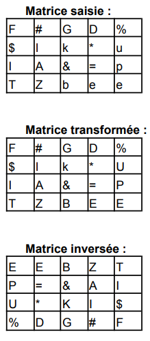

# Exercice 1008

## Enoncé

- Ecrire le sous-programme qui saisit un tableau à deux dimensions de caractères :

4 lignes et 5 colonnes
cf matrice saisie dans l’exemple

- Ecrire le sous-programme qui transforme les voyelles minuscules en majuscules :

cf matrice transformée dans l’exemple
Dans ce sous-programme, une variable décalage sera mise en place. Ne pas mettre de valeur en dur !

- Ecrire le sous-programme qui affiche le tableau de caractères
- Ecrire le sous-programme qui inverse les valeurs du tableau : la valeur qui se trouve à la première place se trouve à la dernière et inversement, la valeur qui se trouve à l’avant-dernière place se positionne à la deuxième place etc. :

cf matrice inversée dans l’exemple

- Ecrire le programme qui met en place ces fonctions. L’affichage interviendra après chaque étape comme présenté dans l’exemple ci-dessous.

Exemple:

## Corrigé

Le code se trouve dans le fichier [main.c](../code/main.c).