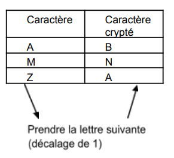
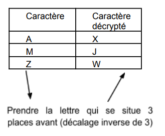

# Exercice 1104

## Enoncé

Ecrire l’algorithme et le code d’un programme et des sous-programmes suivants.

Ecrire un sous-programme appelé menu() dont les fonctionnalités sont les suivantes :
- saisir une chaîne de caractères, l’afficher à l’écran et la rendre à l’appelant
- convertir les caractères de la chaîne saisie en majuscule (vous ne modifierez que les caractères minuscules mais pas les autres et utiliser la table ASCII sans valeur en dur !).

La chaine sera affichée à l’écran

- compter le nombre de voyelles (minuscules et majuscules) dans une chaîne
- convertir les caractères majuscule de la chaîne saisie en minuscule (utiliser la table ASCII sans valeur en dur !)
- comparer 2 chaînes à saisir (utilisez strcmp) et afficher les messages qui correspond
- concaténer 2 chaînes dans la première (attention aux débordements) et afficher le résultat obtenu
- crypter une chaîne de caractères : le cryptage s’applique par un décalage circulaire sur le même alphabet.

La valeur du décalage est saisie par l’utilisateur.

Pour une valeur saisie de 1, le cryptage est le suivant:

- décrypter une chaîne de caractères : le cryptage s’applique par un décalage circulaire inverse au précédent sur le même alphabet.

La valeur du décalage est saisie par l’utilisateur.

Pour une valeur saisie de 3, le décryptage est le suivant:

- quitter l’application

Ecrire un sous-programme pour chaque fonctionnalité du menu décrite plus haut. Vous blinderez votre programme pour garantir que vous travaillez sur des chaînes non vides et redemanderez la saisie dans le cas contraire. 

Ecrire le main(). Le programme principal appellera le menu et recommencera l’exécution tant que l’utilisateur n’aura pas demandé explicitement l’arrêt.

## Corrigé

Le code se trouve dans le fichier [main.c](../code/main.c).

### Algorithme

Pas d'algorithme pour cet exercice.