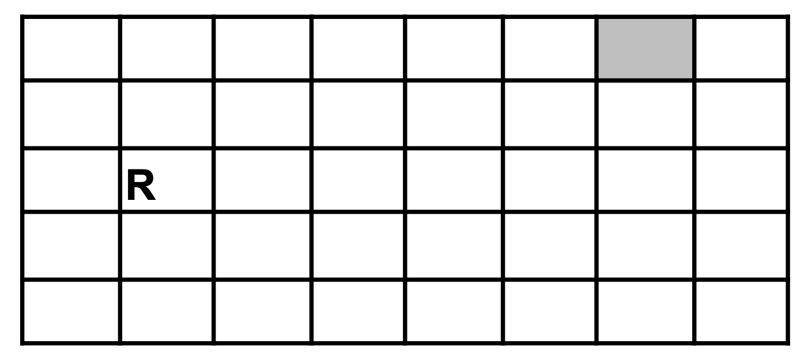

# Exercice 101

## Enoncé

Ecrire le minimum d’instructions qui permettent à un robot R d’arriver à la case grise.
Vous avez ces instructions à votre disposition :

- Avancer à droite
- Avancer à gauche
- Monter d’une case
- Descendre d’une case

## Corrigé

- Monter d'une case
- Monter d'une case
- Avancer à droite
- Avancer à droite
- Avancer à droite
- Avancer à droite
- Avancer à droite