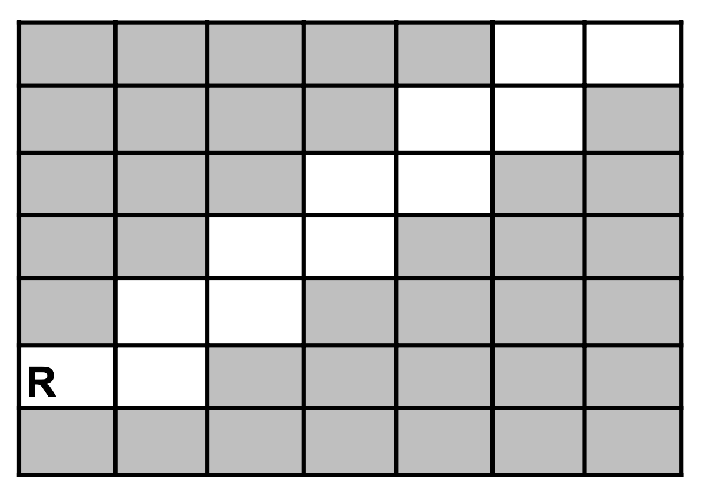

# Exercice 104

## Enoncé

Ecrire le minimum d’instructions qui permettent à un robot R de monter cet escalier. Vous avez ces instructions à votre disposition :

- `Avancer à droite`
- `Avancer à gauche`
- `Monter d’une case`
- `Descendre d’une case`
- `Pour X fois Faire` 
- &nbsp;&nbsp;&nbsp;&nbsp;&nbsp; `Bloc d’instructions`
- `Fin Pour`

Remarque :

Dans le cas de la boucle `Pour X fois Faire` ... Bloc instructions ... `Fin Pour` :
- "X" est un nombre à modifier en fonction de ce que le robot doit faire.
- "Bloc d’instructions" est un bloc qui peut contenir des instructions simples (avancer, descendre, ...) mais aussi d’autres boucles si besoin.




## Corrigé

```java
DEBUT
    Pour 5 fois Faire
        Avancer à droite
        Monter d’une case
    Fin Pour
    Avancer à droite
FIN
```