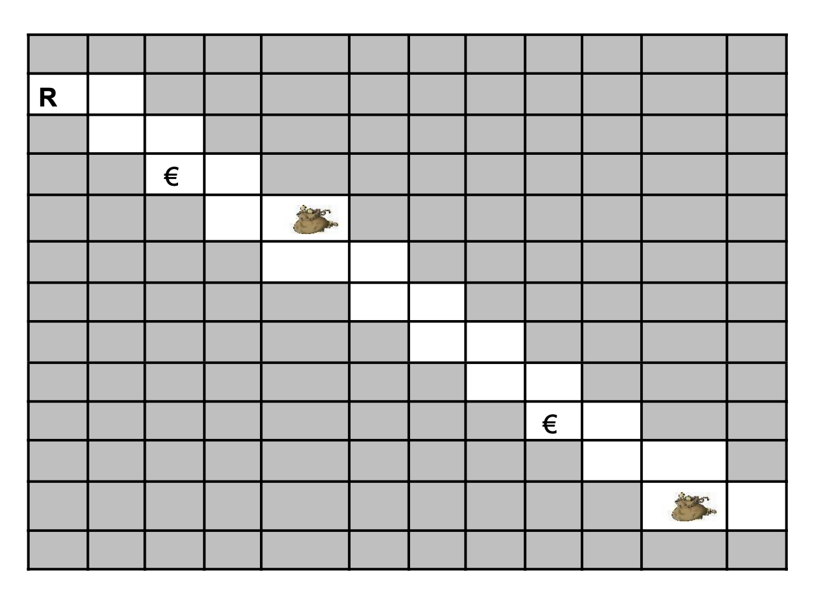

# Exercice 108

## Enoncé

Ecrire le minimum d’instructions qui permet à un robot R d’aller d’un bord du terrain vers un autre tout en ramassant les euros € qui se trouve sur son chemin et en les mettant dans sa bourse tant qu’il se trouve sur une case. Vous avez ces instructions à votre disposition :
- Avancer à droite
- Descendre d’une case
- Pour X fois Faire
    Bloc instructions
  Fin Pour
- Si Condition Alors Bloc d’instructions Fin Si
- Si Condition Alors Bloc d’instructions Sinon Bloc d’instructions Fin Si
- Mur à droite
- Mur en bas
- Argent
- Porte-monnaie
- Ramasser l’argent
- Déposer l’argent
- Sortie du terrain



Remarque :

Dans le cas de la boucle, « Pour X fois Faire....Bloc instructions...Fin Pour »,
- X est un nombre à modifier en fonction de ce que le robot doit faire
- Bloc d’instructions est un bloc qui peut contenir de instructions simples (avancer, descendre, ...) mais aussi d’autres tests et boucles si besoin
Dans le cas des tests ;
- Conditions est à remplacer selon l’obstacle se trouvant sur le chemin du robot R
- Bloc d’instructions est un bloc qui peut contenir de instructions simples (avancer, descendre, ...) mais aussi d’autres tests et boucles si besoin

## Corrigé

```java
DEBUT
    Pour 22 fois Faire
        Si Mur à droite Alors
            Avancer à droite
        Sinon Mur en bas
            Descendre d’une case
        Sinon
            Sortie du terrain
        Fin Si
        SI Argent Alors
            Ramasser l’argent
        Sinon Porte-monnaie
            Déposer l’argent
        Fin Si
    Fin Pour
FIN
```