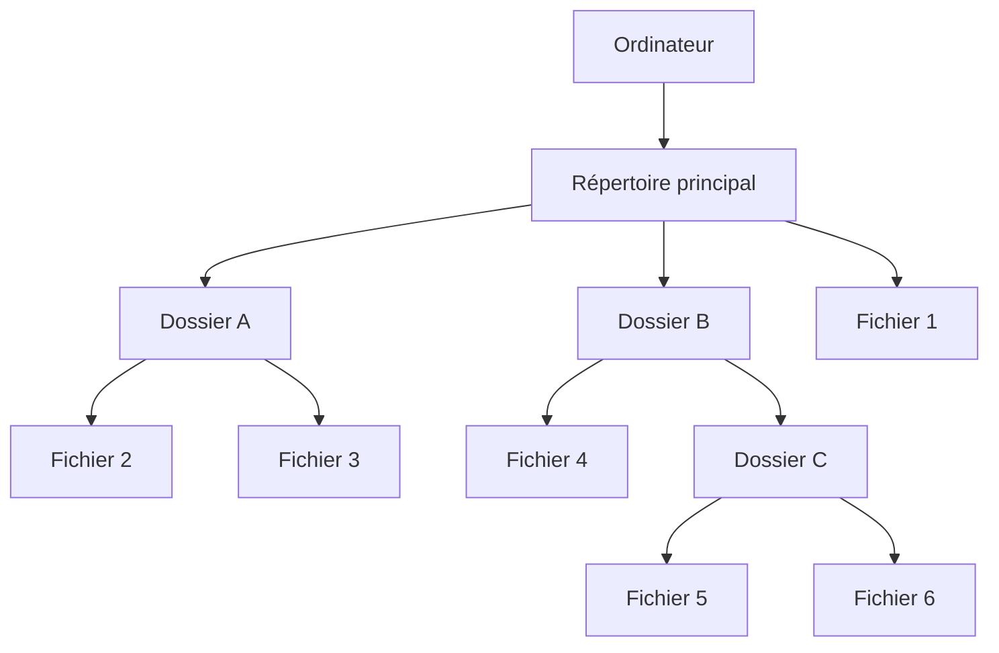

# Exercice 202

## Enoncé

- Quelle différence existe-t-il entre un répertoire et un fichier ?
- Quel type de fichier connaissez-vous ? Comment connait-on le type d’un fichier ?
- Quelles informations nous donnent les propriétés d’un fichier ?
- Comment sont organisés les fichiers et les répertoires sur l’ordinateur ? Faites un schéma rapide.
- Quel est le principe de changement d’emplacement d’un fichier d’un répertoire à un autre ?
- Quel est celui principe de la suppression d’un fichier de l’ordinateur?

## Corrigé

### Répertoire vs Fichier

Un fichier est un document virtuel qui contient des données. On pense par exemple à un fichier pdf ou word. Il existe une multitude de formats qui permettent d'identifier et optimiser le stockage de différents types de documents, que ce soient des images, des vidéos, du texte, ou des images vectorielles. 

Un répertoire, en revanche, est simplement un dossier dans lequel on peut virtuellement ranger nos différents fichiers. Les dossiers permettent de garder notre machine organisée et d'éviter d'avoir des documents dans tous les sens.

### Types de fichiers

Il existe ds centaines de types de fichiers. Pour les reconnaitre, il faut regarder l'extention (ce qui suit le "."). Voici quelques exemples:

| Extension | Utilité |
|:---------:|:--------|
| txt       | Contient du texte pur, sans formattage ni mise en page |
| jpeg/jpg  | Permet de stocker des images dans un format compressible. Ce format est très économe en espace disque |
| png       | Stocke une image. A la particularité d'avoir un canal de transparence pour des images sans fond |
| mp3       | Est un format de stockage audio |
| mp4       | Stocke une vidéo et la piste audio dans un seul format |
| pdf       | Permet d'enregistrer des documents en documents à plusieurs pages non-modifiables |
| svg       | Stocke des images vectorielles, c'est à dire les équations qui dessinent les formes de l'image |
| docx      | Document propriétaire Microsoft Word |
| psd       | Fichier propriétaire de photoshop |
| html      | Site web |
| exe       | (Sous windows) Un fichier exécutable. Le processeur peut le lire et effectuer les instructions comprises dedans |
| md        | Document MarkDown. Les fichiers dans les dossiers ".source" sont des fichiers md. Sur github, le wiki est aussi fait en MarkDown |
| c         | Fichier de code en C |
| py        | Fichier de code en python |

Il en existe évidemment plein d'autres.

### Propriétés d'un fichier

Les propriétés d'un fichier (Clic Droit + Propriétés sur Windows ou Clic Droit + Lire les Infos sur mac) contiennent des infos relatives au fichier en question. Il y a, entre autres :

- La date et heure de création, de dernière modification et de dernière ouverture du fichier
- La taille en octets
- Le nom et extension
- Le chemin depuis le dossier racine
- Les droits d'accès lecture écriture

### Organisation des fichiers et répertoires

### Principe de déplacement de fichier

Le principe de déplacement d'un fichier est de le copier dans un autre dossier, puis de le supprimer du dossier d'origine. Lorsqu'on déplace un fichier au sein d'une même partition, le déplacement est dit atomique, c'est à dire qu'il n'est pas déplacé sur le disque, seulement dans la table des fichiers. Lorsqu'on déplace un fichier d'une partition à une autre, le fichier est copié sur le disque, puis supprimé de la partition d'origine.

### Suppression d'un fichier

La suppression d'un fichier consiste à marquer la place qu'il occuppe sur le disque comme libre. Réellement supprimer le fichier est une perte de temps, puisque lorsque l'espace anciennement occupé a besoin d'être utilisé, les données seront simplement écrasées. C'est d'ailleurs pour ca que les logiciels de récupération de données fonctionnent : ils vont chercher les données dans des espaces marqués comme libres, mais qui ne sont pas encore écrasés.

## Commentaires d'Exercice

Certaines questions sont un peu compliquées à interpréter (notamment l'Organisation des fichiers) mais ca se fait...