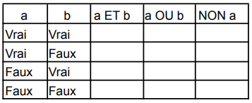
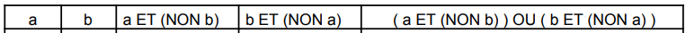

# Exercice 503

## Enoncé

Etablir les tables de vérité pour les opérateurs logiques ET, OU, NON.

A partir de ces résultats, indiquez les valeurs des expressions logiques suivantes selon les
valeurs de a et b.

## Corrigé

Le code se trouve dans le fichier [main.c](../code/main.c).

### Tables de vérité

| a | b | a && b | a \|\| b | !a |
|---|---|--------|----------|----|
| 0 | 0 | 0      | 0        | 1  |
| 0 | 1 | 0      | 1        | 1  |
| 1 | 0 | 0      | 1        | 0  |
| 1 | 1 | 1      | 1        | 0  |

| a | b | a && (!b) | b && (!a) | a && (!b) \|\| b && (!a) |
|---|---|-----------|-----------|--------------------------|
| 0 | 0 | 0         | 0         | 0                        |
| 0 | 1 | 0         | 1         | 1                        |
| 1 | 0 | 1         | 0         | 1                        |
| 1 | 1 | 0         | 0         | 0                        |