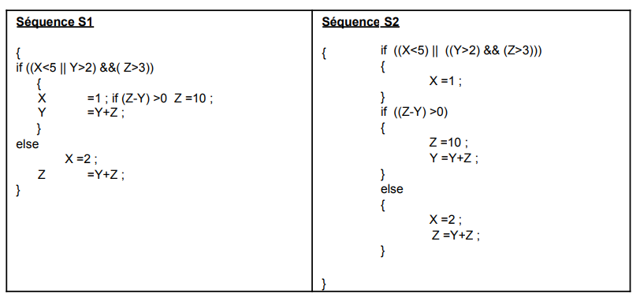

# Exercice 505

## Enoncé

Vous savez que la machine ne se préoccupe pas de l’indentation de vos programmes. Cela n’apporte qu’un confort pour les lecteurs de code.

Pour vous en convaincre, voici des algorithmes écrits avec une indentation un peu vague. Essayez de vous y retrouver et d’en comprendre l’importance de respecter une indentation correcte dans vos programmes.

Rappelez-vous que sans bloc, la machine ne conditionne ou ne répète qu’une seule instruction. Appliquez ces règles sur l’exemple ci-dessous en tentant de suivre l’évolution du contenu des variables X, Y et Z au fur et à mesure de l’exécution du code en réalisant une trace d’exécution (ce qui revient à faire tourner le code à la main). X,Y, et Z étant des variables numériques, on considère les deux séquences algorithmiques S1 et S2.

Pour chacune des deux séquences, donner les traces d’exécution de X, Y, et Z si l’on suppose qu’à l’état initial ces trois variables ont les valeurs :

        X :=4 Y :=1 Z :=4
        X :=4 Y :=5 Z :=4
        X :=1 Y :=3 Z :=1

Priorité des opérateurs : ANNEXE

Testez les codes qui suivent sur papier puis sur Codeblocks pour vous assurer d’avoir trouvé les bonnes réponses.

**Rappel : en l’absence de bloc début-fin ou {-} les boucles et les tests ne portent que sur l’instruction qui suit immédiatement.**

## Corrigé

Le code se trouve dans le fichier [main.c](../code/main.c).

Cet exercice a une erreur dans la première séquence. Le `if` n'a pas de parenthèses autours de la condition entière. Cet Exercice restera non fait pour l'instant.

Je ne sais pas si les deux algorithmes sont sensés être identiques avec une indentation différente, ou si c'est voulu, en mettant les parenthèses différemment. Ce qui est sûr c'est que le premier algorithme n'est pas compilable.