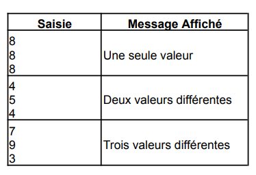

# Exercice 602

## Enoncé

Donner l’algorithme, l’organigramme et le programme qui déterminent le nombre de valeurs différentes saisies parmi trois variables.

Exemple :



## Corrigé

Le code se trouve dans le fichier [main.c](../code/main.c).

### Algorithme

```java
DEBUT
    // Déclaration des variables
    entier a, b, c, nbValeursDifferentes;

    // Saisie des valeurs
    AFFICHER "Saisir la valeur de a :"
    LIRE a
    AFFICHER "Saisir la valeur de b :"
    LIRE b
    AFFICHER "Saisir la valeur de c :"
    LIRE c

    // Test des valeurs
    nbValeursDifferentes = 0
    SI a != b ET a != c ALORS
        nbValeursDifferentes = nbValeursDifferentes + 1
    FINSI
    SI b != a ET b != c ALORS
        nbValeursDifferentes = nbValeursDifferentes + 1
    FINSI
    SI c != a ET c != b ALORS
        nbValeursDifferentes = nbValeursDifferentes + 1
    FINSI

    // Affichage du résultat
    AFFICHER "Il y a ", nbValeursDifferentes, " valeurs différentes"
FIN
```

### Organigramme

Pas d'organigramme pour cet exercice.