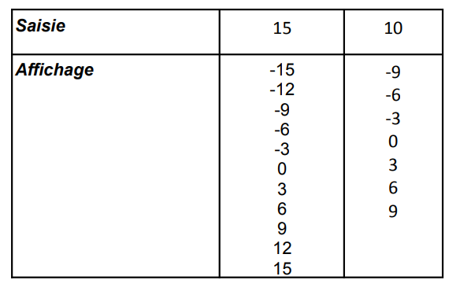

# Exercice 703

## Enoncé

Ecrire l’algorithme et le programme C qui affiche les multiples de 3 compris entre l’entier positif saisi et son opposé.

Exemple:



## Corrigé

Le code se trouve dans le fichier [main.c](../code/main.c).

```java
DEBUT
    ENTIER i, n
    ECRIRE "Entrez un entier positif :"
    LIRE n
    POUR i DE n A -n PAS -3 FAIRE
        ECRIRE i
    FINPOUR
FIN
```	